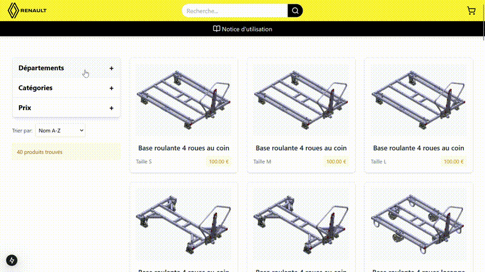
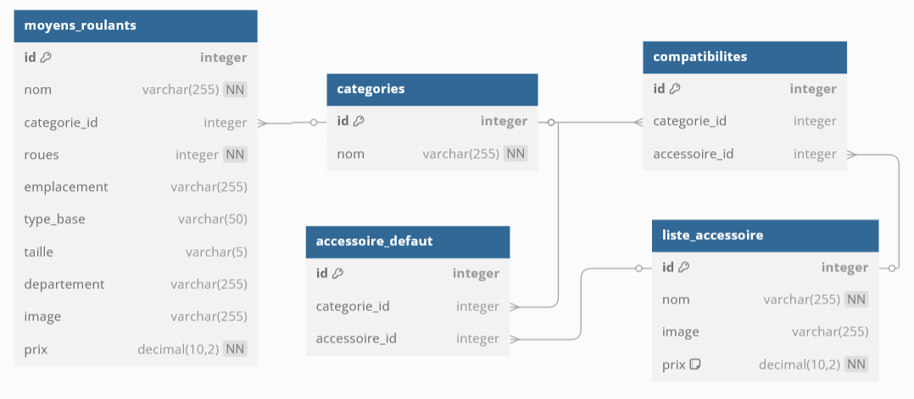

# PROJET_PIL - PIL ISEL

## Introduction
Dans le cadre du Projet d’Innovation Logistique (PIL) de l’ISEL, notre équipe a été missionnée par Renault pour concevoir une marketplace dédiée à la gestion des commandes de moyens logistiques non motorisés. L’objectif : proposer une solution digitale intuitive, capable de centraliser les besoins internes et de fluidifier les processus de commande.
Ce livrable présente l’architecture technique du démonstrateur développé, ainsi que l’état d’avancement fonctionnel du MVP. Il dresse également un panorama des pistes d’évolution envisageables pour industrialiser et généraliser l’outil à l’échelle multi-sites. L’accent est mis sur les choix technologiques opérés, la logique modulaire de conception, et les briques critiques restant à implémenter pour répondre aux enjeux opérationnels du groupe Renault.

## Stack technologique
L’architecture repose sur une approche en couches clairement délimitées : frontend, backend et base de données.
**Frontend**
- React.js (SPA)
- TypeScript
- Routage : react-router-dom
- Visualisation 3D : react-three-fiber
- Réalité augmentée : @google/model-viewer
- Styles : TailwindCSS
**Backend**
- Go
- Framework : Echo
**Base de données**
- PostgreSQL

## Infrastructure & déploiement
- Docker (conteneurs isolés : frontend, backend, BDD)
- Reverse proxy : Traefik
- Hébergement : VPS dédié

## Démo en ligne
Le projet est accessible à : [https://projet.srairi.fr](https://projet.srairi.fr)

## Prérequis
- Docker

## Schéma base de données relationnelles

## Auteurs
- Amira AOUDIA
- Souhail EJNAINI
- Yanis SRAIRI